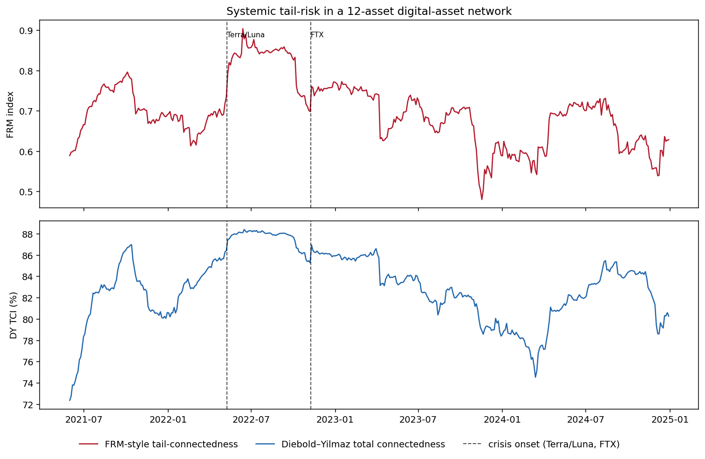

[](http://quantlet.de/)

##  **IDA_FRMspillover**

```yaml
Name of QuantLet: IDA_FRMspillover

Published in: Institute for Digital Assets (IDA)

Description: 'Computes two systemic-risk indices on the same rolling windows of real daily
  digital-asset returns (12 liquid assets, 2021-2024, Yahoo Finance): an FRM-style
  tail-connectedness index (mean L1 norm of penalised 5% quantile-regression coefficients
  of each asset on the others, a Haerdle-FRM proxy) and a Diebold-Yilmaz total connectedness
  index from a VAR(1) generalised forecast-error-variance decomposition. The FRM-style index
  is elevated and rising into the Terra/Luna collapse (May 2022) but does not locally lead
  the idiosyncratic FTX failure (Nov 2022) - the contrast motivating a finite-sample
  reliability theory for systemic tail-risk meters.'

Keywords: 'FRM, financial risk meter, systemic risk, tail risk, quantile regression, LASSO,
  connectedness, Diebold-Yilmaz, spillover, cryptocurrency, network, VaR'

Author: Daniel Traian Pele

Submitted: 25 June 2026

Datafiles: 'prices_cache.csv'

Output: 'systemic_indices.png, systemic_indices.csv, poc_results.md'
```



### Reproduce

```bash
pip install -r requirements.txt
python frm_spillover_poc.py
```

The script uses the cached prices in `prices_cache.csv`; delete that file to re-download from
Yahoo Finance. It writes `systemic_indices.csv` (the two indices on each rolling window),
`systemic_indices.png` (the figure above) and `poc_results.md` (the early-warning read-out).
